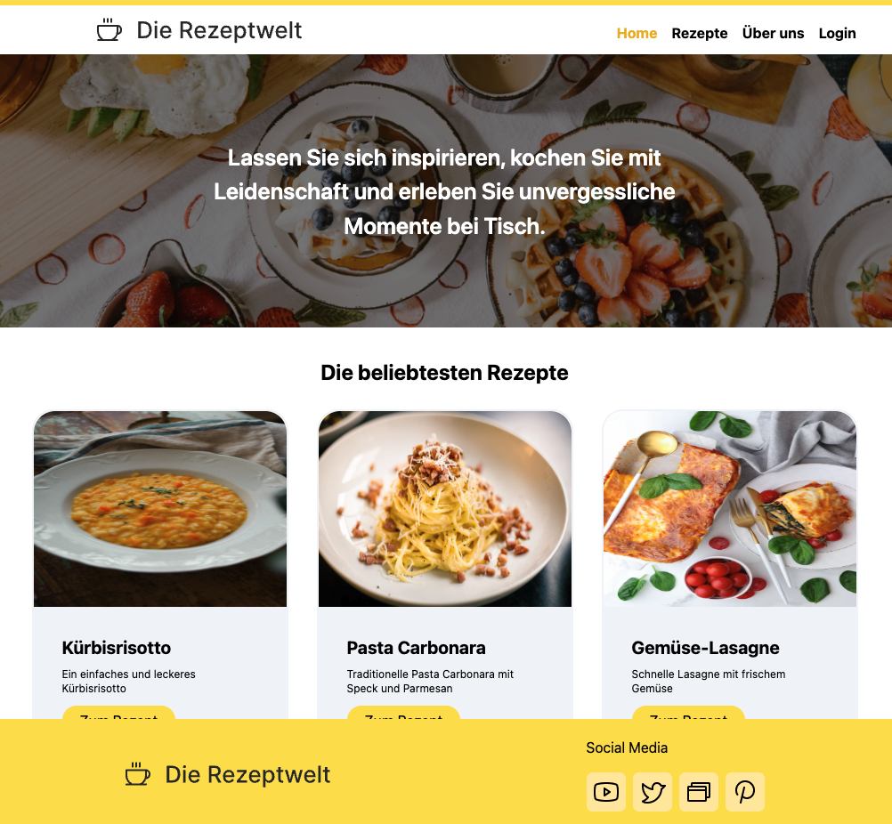

# Project Rezeptwelt 🍰🍝🌮

Rezeptwelt is a recipe app developed using React, TypeScript, Tailwind CSS, and Supabase as the backend. The project follows a partially provided Figma design.

## Features

- **User Authentication:** Users can register or log in to their accounts.
- **Recipe Recommendations:** Popular or latest recipes are suggested to users.
- **Recipe Details:** Users can view recipes in detail and save them as favorites.
- **User Dashboard:** Users can access their profile information, saved favorites, and have the option to create their own recipes, including photos, ingredients, measurements, and preparation steps, through a form.
- **Navigation:** A user-friendly and clear navigation is provided via the header.

## Preview



## Installation

To get started with the project, follow these steps:

1. Clone the repository:

   ```bash
   git clone git@github.com:sharonVko/Project-Rezeptwelt.git
   ```

2. Navigate to the project directory:

   ```bash
   cd rezeptwelt
   ```

3. Install dependencies:

   ```bash
   npm install
   ```

4. Start the development server:
   ```bash
   npm start
   ```

## Technologies Used

- **React:** A JavaScript library for building user interfaces.
- **TypeScript:** A typed superset of JavaScript that compiles to plain JavaScript.
- **Tailwind CSS:** A utility-first CSS framework for rapid UI development.
- **Supabase:** An open-source Firebase alternative for providing backend services.

## Contributing

Contributions are welcome! Please fork this repository and submit pull requests.
